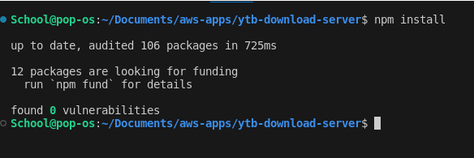
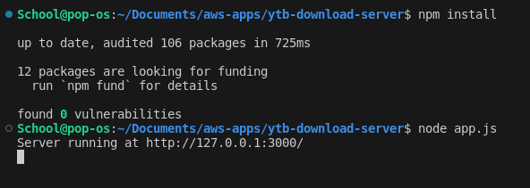
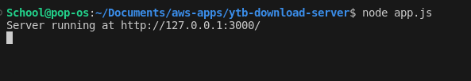
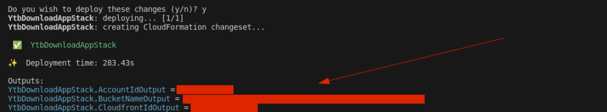
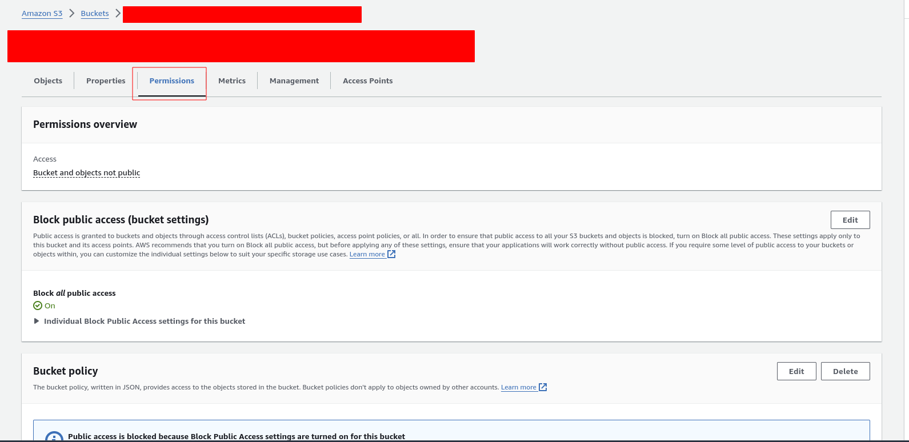
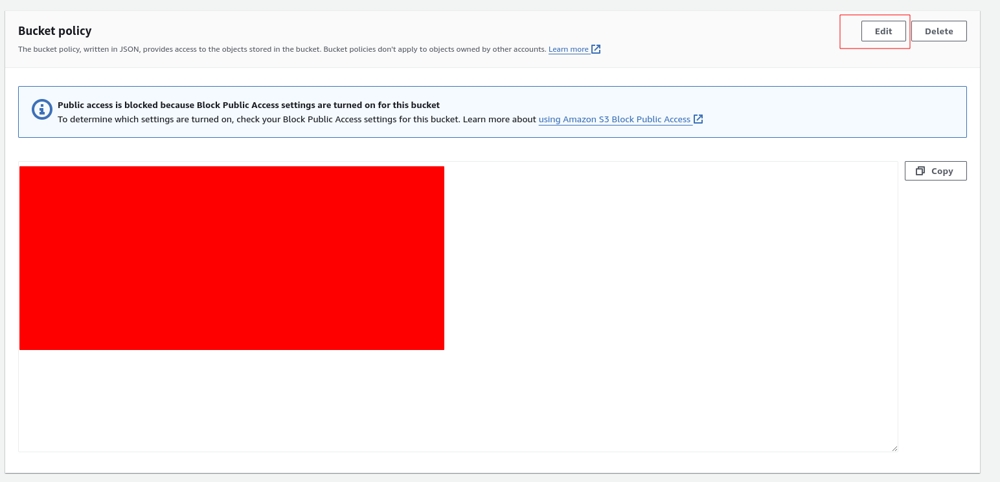

# Basic YouTube Downloader Extension - Server Side Code
Server-side code for YouTube Downloader chrome extension

## Local Usage
1. Clone this repository: 
```
git clone https://github.com/SagaOfAGuy/ytb-download-server.git
```

2. Install the node package dependencies: 
```
cd ytb-download-server && npm install
```



3. Start the Node server:
```
node app.js
```


4. App.js should now be running on port 3000: 




## Deploying Application Infrastructure in AWS

Doing this would allow you to create the S3 bucket that hosts the download Youtube Videos, and the Cloudfront Distribution that gives users access to download the Videos

Pre-requisite: 
[Install the `cdk` command line utility](https://docs.aws.amazon.com/cdk/v2/guide/cli.html)

1. Navigate to the `ytb-download-infra` folder: 
```
cd ytb-download-infra
```

2. Run the CDK deploy command

```
cdk deploy
```

3. Manually edit the S3 policy for the created S3 bucket. For some reason OAIs are still used and a default OAI policy is automatically created for the S3 bucket. In order for this project to work, we need to replace the S3 policy with something like this: 

```
{
    "Version": "2012-10-17",
    "Statement": [
        {
            "Sid": "AllowCloudFrontServicePrincipalReadOnly",
            "Effect": "Allow",
            "Principal": {
                "Service": "cloudfront.amazonaws.com"
            },
            "Action": "s3:GetObject",
            "Resource": "arn:aws:s3:::<S3 BUCKET NAME>/*",
            "Condition": {
                "StringEquals": {
                    "AWS:SourceArn": "arn:aws:cloudfront::<AWS ACCOUNT NUMBER>:distribution/<CLOUDFRONT DISTRIBUTION ID>"
                }
            }
        }
    ]
}
```

After we run `cdk deploy`, we should get an output of 3 values which are: 
- AWS Account Id (YtnDownloadAppStack.AccountIdOutput)
- S3 bucket name (YtnDownloadAppStack.BucketNameOutput)
- CloudFront Distribution Id (YtnDownloadAppStack.CloudfrontIdOutput)

The values you would take note of are behind the red redaction highlighting. I have redacted my values in red for privacy. 




1. We can plug those 3 values into the `<S3 BUCKET NAME>`, `<AWS ACCOUNT NUMBER>` and `<CLOUDFRONT DISTRIBUTION ID>` fields in the S3 bucket JSON that we will paste in as the policy: 


```
{
    "Version": "2012-10-17",
    "Statement": [
        {
            "Sid": "AllowCloudFrontServicePrincipalReadOnly",
            "Effect": "Allow",
            "Principal": {
                "Service": "cloudfront.amazonaws.com"
            },
            "Action": "s3:GetObject",
            "Resource": "arn:aws:s3:::<S3 BUCKET NAME>/*",
            "Condition": {
                "StringEquals": {
                    "AWS:SourceArn": "arn:aws:cloudfront::<AWS ACCOUNT NUMBER>:distribution/<CLOUDFRONT DISTRIBUTION ID>"
                }
            }
        }
    ]
}
```


4. To make the change, we can go to the S3 dashboard, browse to the S3 bucket that our CDK script created (It should be in the Output of the `cdk deploy` output which should be the output of the `YtbDownloadAppStack.BucketNameOutput` value)

We click on the **"Permissions"** tab




5. Next, we go to down to the **"Bucket Policy"** section, and we click the **"Edit"** button: 




6. Then, we would fill in the placeholders  `<S3 BUCKET NAME>`, `<AWS ACCOUNT NUMBER>` and `<CLOUDFRONT DISTRIBUTION ID>` in the S3 bucket policy template seen in step 4, and we paste it into the text field, and click **"Save Changes"**. 

7. The Cloudfront Distribution should now be synced with the S3 bucket and allow users to download videos without getting the `Access Denied` error. 

## Deploying AWS App Runner service + App infra
Coming soon


